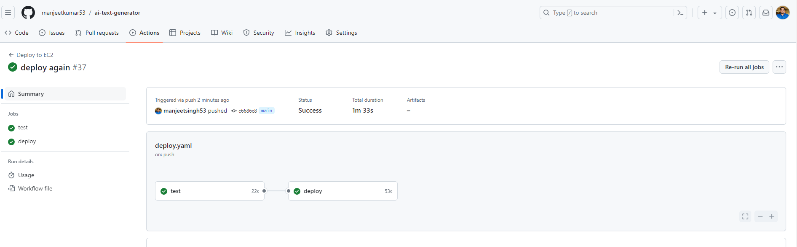

# Ai-Text-Generator

AI project to Generate output based on user input using any LLM. App has been developed based on this [requirement](docs/index.md)

This is a Python web application. This guide will help you set up the development environment, run the application locally, and deploy it using GitHub Actions to an AWS EC2 instance.

## Ai-Text-Generator - Key Highlights

This readme highlights some of the key features and functionalities of the Ai-Text-Generator app:

- **Versatile LLM Support:** Leverage the power of different Large Language Models (LLMs) like OpenAI and Ollama. This flexibility allows you to choose the LLM that best suits your needs based on cost and capabilities.
- **Database Agnostic:** The application can seamlessly work with both SQLite and MySQL databases. Choose the database that best integrates with your existing infrastructure or project requirements.
- **Focus on Code Quality:** The well-defined tests mentioned in the readme indicate a strong emphasis on code quality. This translates to a more reliable and functional application.
- **Enhanced Monitoring:** The app benefits from well-defined logging, which is crucial for debugging and monitoring the application's health.
- **Streamlined Deployment:** Save time and effort with the fully functional CI/CD pipeline. This pipeline automates testing and deployment to your AWS EC2 instance.

## Prerequisites

- Python 3.12 or higher
- pip (Python package installer)
- Git
- AWS account and access to create EC2 instances
- GitHub account

## Local Development Setup

1.  **Clone the Repository**

    ```sh
    git clone https://github.com/manjeetkumar53/ai-text-generator.git
    cd ai-text-generator
    ```

2.  **Create and Activate Virtual Environment**

    ```sh
    python3 -m venv venv
    source venv/bin/activate  # On Windows, use `venv\Scripts\activate`
    ```

3.  **Install Dependencies**

    ```sh
    pip install -r requirements.txt
    ```

4.  **Run the Application**

    ```sh
    cd src
    python app.py
    ```

5.  **Run the Application using flask**

    ```sh
    cd src
    flask run
    ```

6.  **Run the Application using gunicorn** Guide to set-up [gunicorn](setup_gunicorn.md)

    ```sh
    gunicorn --bind 127.0.0.1:5000 appserver:gunicorn_app #run from root project root dir
    ```

#### Your application should now be running locally at `http://127.0.0.1:5000` (or the port specified in your app).

## Running Application using different LLMs

1. **Run the Application using OpenAI**

- open `.env` file
- Inside .env file set properties `OPENAI_API_KEY` and `LLM_NAME` (as shown below)

```properties
OPENAI_API_KEY=sk-xxxxxx
LLM_NAME = "OpenAI"
```

2. **Run the Application using Ollama**

- [Set-up ollama on your machine](https://github.com/ollama/ollama)
- open `.env` file
- Inside .env file set properties `LLM_NAME` (as shown below)

```properties
LLM_NAME = "Ollama"
```

## Running Application using different Database

1. **Run the Application using MySQL**

- open `.env` file
- Inside .env file set mysql host, user, password and database properties as shown below and run application

```properties
MYSQL_HOST="localhost"
MYSQL_USER="user"
MYSQL_PASSWORD="pass"
MYSQL_DATABASE="rag_db"
DB_NAME = "mysql"
```

2. **Run the Application using Sqllite DB**

- open `.env` file
- Inside .env file set properties as shown below and run application

```properties
DB_NAME = "sqllite"
```

## Running Tests

1. **Run test using Pytest**

```shell
pytest
```

_or_

```sh
#tests in name of dir containing all test file
pytest tests
```

2. **Run test using unittest**

_Run complete test: This will initiate the discovery process, locate all your test cases, and run them sequentially. You'll see the results displayed in the terminal, indicating which tests passed and if any failed._

```sh
python -m unittest discover
```

_or_

```sh
python -m unittest discover tests
```

3. **Run test for individual file using unittest**

```sh
python -m unittest test_dbhandler_mysql.py
```

## Setting CI/CD pipeline (deployment to AWS EC2)

### 1. Set Up AWS EC2 Instance

- Launch an EC2 instance using the AWS Management Console.
- Choose an Amazon Linux 2 AMI.
- Create a new key pair or use an existing one for SSH access.
- Ensure the security group allows SSH (port 22) and HTTP/HTTPS (ports 80/443).
- My EC2 instance example
  

### 2. Configure GitHub Repository

- Push your code to a GitHub repository.
- Set secrets Refer to [CI/CD set up guide](setup_cicd.md) to set-up CI/CD pipeline.

### 3. Set Up GitHub Actions

1. **Create GitHub Actions Workflow**

- In your GitHub repository, create a file at `.github/workflows/deploy.yaml`
- Refer to [CI/CD set up guide](setup_cicd.md) to set-up pipeline.

### 5. Deploy Application

- Commit and push your changes to the `main` branch of your GitHub repository.
- This triggers the GitHub Actions workflow, which builds the application, runs tests, and deploys it to your EC2 instance.
- On sucessfull deployment you will see both test & deploy should be green (pass)
  
- In case of any CI/CD error you will get notification on your account linked to github account (see example)
  

Your application should now be accessible via the public IP or DNS of your EC2 instance.
See below example


## Troubleshooting

- Ensure your EC2 instance's security group allows inbound traffic on the required ports.
- Check the GitHub Actions logs for any errors during the build or deployment process.
- Verify that the correct environment variables and secrets are set in GitHub.

## License

This project is licensed under the MIT License.
